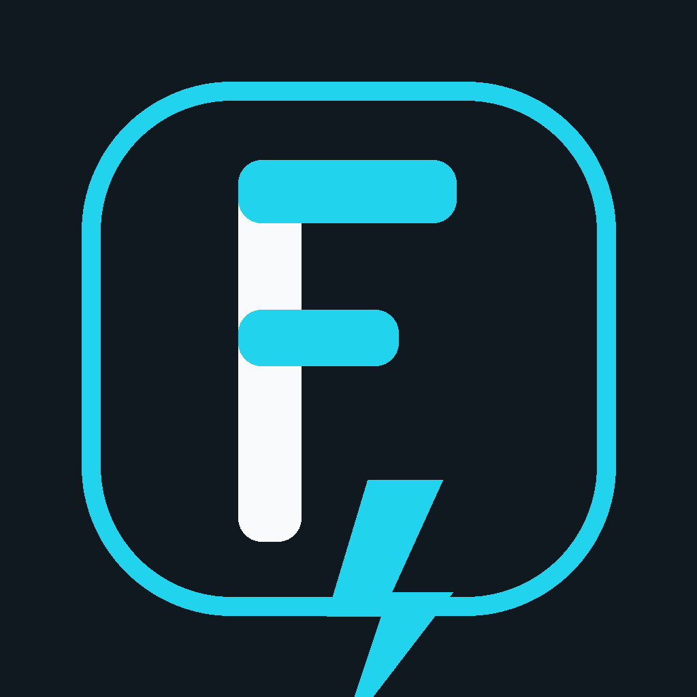
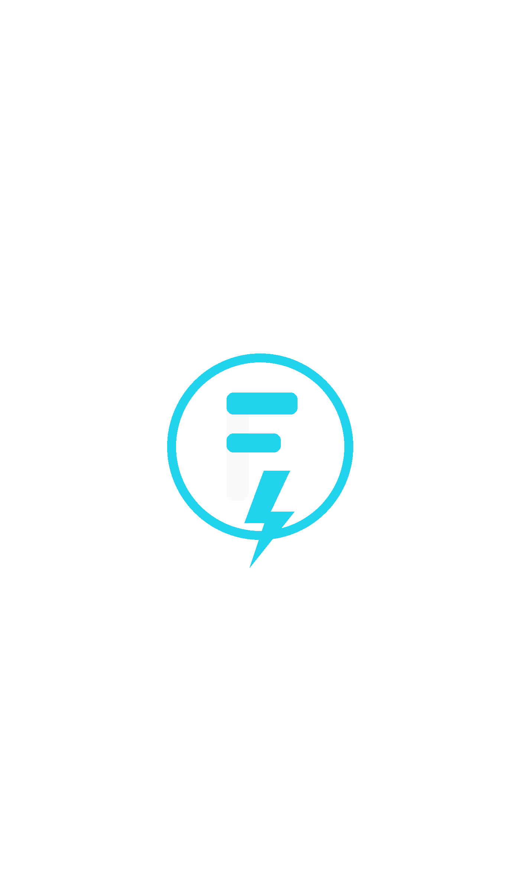
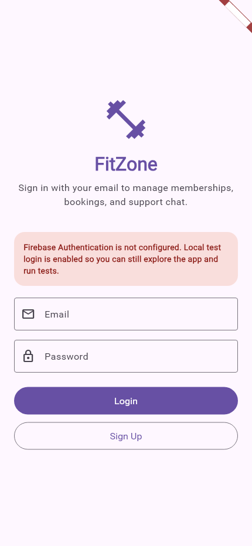
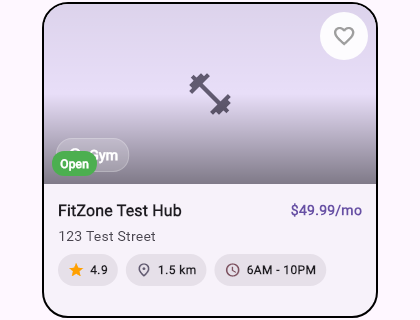

# Endterm Report

In this endterm project, I continued improving my existing Flutter fitness centers app instead of creating a new one. I kept the main app logic, routing, Firebase setup, and booking flow, and focused on adding the final required features in a clean way.

The first big part I added was Chapter 19 platform-specific branding. I changed the app identity to `FitCenter` / `FitZone`, generated a new launcher icon, updated the Android and iOS app names, changed the web title and favicon, and added a branded splash screen. I also replaced the earlier icon idea with a more minimal modern `F` logo so the app looks cleaner and more professional across Android, iOS, macOS, and web.

  
  

The second big part I added was a new Firebase-based functional feature: booking history. Now when a user creates or cancels a booking, the app stores a clear history in Firestore with details about who booked, what membership was booked, quantity, total price, booking type, and the exact time. I also made the Firebase history more readable by adding booking codes and user labels, and I showed this history inside the `My Bookings` screen in the app.

The testing part was already added before, so this final stage helped connect everything together: the app now has testing support, proper branding assets, and a real Firebase feature that is useful and visible. Overall, I kept the project structure stable and extended the app step by step in a way that feels assignment-ready and practical.

## Screenshots

### Login Screen

### Fitness Center Card

# Testing Report

- I added testing support to my existing Flutter fitness center app without creating a new project or rewriting the app.
- I updated `pubspec.yaml` and added the testing packages I needed:
  - `integration_test`
  - `mocktail`
  - `golden_toolkit`
- I organized the testing structure into:
  - `test/unit`
  - `test/widget`
  - `test/helpers`
  - `test/golden`
  - `integration_test`
- For unit tests, I covered:
  - booking/cart logic
  - auth validation
  - `FitnessCenter` JSON serialization
  - `MembershipPlan` JSON serialization
  - in-memory Drift booking insert, retrieve, and delete flow
- For widget tests, I covered:
  - login page rendering and validation
  - booking page list, delete flow, and empty state
  - fitness center card display and tap navigation
- For golden tests, I added visual snapshot tests for:
  - login page
  - fitness center card
- For integration testing, I created one full user flow:
  - app start
  - login
  - open home
  - open fitness center
  - choose membership
  - create booking
  - verify booking appears in My Bookings
- I added fake test data and mock services so the tests do not depend on:
  - real Firebase
  - real Firestore
  - real internet
  - real persistent database data
- I made a few small production changes to improve testability:
  - added reusable auth validation
  - turned login into a proper form with validation
  - added stable widget keys
  - added local fallback login when Firebase is not configured
  - added in-memory Drift database support for tests
- I created `TESTING.md` with commands for:
  - normal test runs
  - integration tests
  - coverage
  - golden updates
- What succeeded:
  - `flutter test` passed
  - golden tests passed
  - unit, widget, and golden setup is complete
  - integration test file is ready
- One note:
  - the integration test could not be run in this environment because only a web device was available, and Flutter integration tests need a supported non-web device or emulator
- Overall, I completed a clean, simple, assignment-ready testing setup for the existing app.
